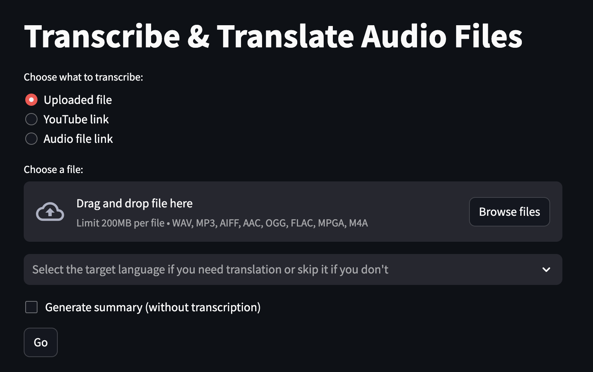
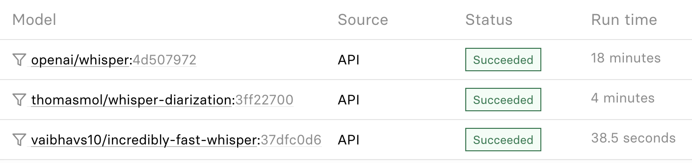

# The Transcriber

Transcriber &amp; translator for audio files. Like Otter.ai but open-source and almost free.



## Otter.ai

[Otter.ai](https://otter.ai/pricing) monthly subscription is **\$16.99**/per user. \
Where you get:
> 1200 monthly transcription minutes; 90 minutes per conversation

## The Transcriber app

**Transcription**:
[Replicate AI models cloud-hosting](https://replicate.com/pricing) with current prices and models used, 1200 minutes will cost approximately **\$5.50** \
At least three times cheaper with the same or even better quality of transcription, in my opinion. \
And you pay as you go.

**Translation and summerization**:
[Gemini 1.5 Pro](https://ai.google.dev/pricing) is **free**, if you use Gemini API **from a project that has billing disabled**, without the benefits available in paid plan.

**Hosting**:
Free tires or trials of [Render](https://render.com/pricing), [Google Cloud](https://cloud.google.com/free), [Orcale Cloud](https://www.oracle.com/cloud/free/), [AWS](https://aws.amazon.com/free/), [Azure](https://azure.microsoft.com/en-us/pricing/free-services), [IBM Cloud](https://www.ibm.com/cloud/free), or low-cost [DigitalOcean](https://www.digitalocean.com/), or any you like.

**Total**:
Pay as you go for 10 hours audio.
Replicate + free Gemini API + DigitalOcean = \$0.25 + \$0.00 + \$0.10 = **\$0.35**

## Technical details

[Run Whisper model on Replicate](https://replicate.com/openai/whisper) much cheaper than using [OpenAI API for Whisper](https://openai.com/pricing).

I use two models:

[vaibhavs10/incredibly-fast-whisper](https://replicate.com/vaibhavs10/incredibly-fast-whisper) best for speed \
[thomasmol/whisper-diarization](https://replicate.com/thomasmol/whisper-diarization) best for dialogs

Same audio 45 minutes (6 speakers) comparison by model


### Limitations

#### OpenAI Whisper model

[OpenAI Speech to text Whisper model](https://platform.openai.com/docs/guides/speech-to-text)

> File uploads are currently limited to 25 MB.

To avoid this limitation, I use compression (Even though I know the models I'm using use compression, too. In practice, I've encountered a limit when relying on compression in a model). The file size without compression is 63 MB for 45 minutes of audio. However, after compression, the file size reduces to 4 MB for the same duration. Therefore, using compression, we can avoid splitting audio into chunks, and we can increase the limit to approximately 3 hours and 45 minutes of audio without losing transcription quality.

But if you still need to transcript more you can split file using [pydub's](https://github.com/jiaaro/pydub/blob/master/API.markdown) `silence.split_on_silence()` or `silence.detect_silence()` or `silence.detect_nonsilent()`. This function's speed is hardware-dependent, but it is about 10 times faster than listening to the entire file.

In my tests, I face three main problems:

1. These functions are not working as I expect.
2. If split just by time, you can cut in the middle of a word.
3. Post-processing becomes a challenge. It's hard to identify the speaker smoothly. Loss of timestamps.

All this beloongs to very long audio only.

#### Gemini 1.5 Pro

[Gemini 1.5 Pro model name and properties](https://cloud.google.com/vertex-ai/generative-ai/docs/learn/models)

> Max output tokens: 8,192

0.75 words per token = ~6,144 words or about 35 minutes of speaking. But for [non-English languages](https://mor10.com/openai-token-tax/), most words are counted as two or more tokens.

The maximum number of tokens for output is currently 8,192. Audio post-processing, which includes correction and translation, can only be done for files that are approximately 35 minutes long. Other models have a maximum output of 4,096 or less. If you need to process more than 8,192 tokens, you may need to do it in batches, but this will significantly increase the processing time.

Translation by chunks still works, but the quality little bit lower.

> Max audio length: approximately 8.4 hours

It still works well for summarization.

> [2 queries per minute, 1000 queries per day](https://ai.google.dev/gemini-api/docs/models/gemini#model-variations)

[Languages support](https://cloud.google.com/vertex-ai/generative-ai/docs/learn/models#language-support) for translation.

### Config

Example of `.env` file:

```text
GEMINI_API_KEY = your_api_key
REPLICATE_API_TOKEN = your_api_key
```

You need to replace the path to the env_file in `compose.yaml`

[Get Gemini API key](https://ai.google.dev/) \
[Get Replicate API key](https://replicate.com/account/api-tokens)

[Streamlit Secrets management](https://docs.streamlit.io/develop/concepts/connections/secrets-management)

### Docs

|  | Links |
| ---|--- |
| Libraries | [streamlit](https://docs.streamlit.io)<br> [replicate](https://replicate.com/docs/get-started/python)<br>[google-generativeai](https://ai.google.dev/gemini-api/docs/get-started/python)<br>[pytube](https://pytube.io/en/latest/) |
| Docker | [Docker Best Practices](https://testdriven.io/blog/docker-best-practices/)<br><br>[Docker](https://docs.docker.com/language/python/)<br>[Dockerfile reference](https://docs.docker.com/reference/dockerfile/)<br>[Dockerfile Linter](https://hadolint.github.io/hadolint/)<br><br>[.dockerignore](https://docs.docker.com/build/building/context/#dockerignore-files)<br><br>[Docker Compose](https://docs.docker.com/compose/)<br>[Syntax for environment files in Docker Compose](https://docs.docker.com/compose/environment-variables/env-file/)<br>[Ways to set environment variables with Compose](https://docs.docker.com/compose/environment-variables/set-environment-variables/)<br>[Compose file version 3 reference](https://docs.docker.com/compose/compose-file/compose-file-v3/)|
| GitHub Actions | [Workflow syntax for GitHub Actions](https://docs.github.com/en/actions/using-workflows/workflow-syntax-for-github-actions)<br>[Publishing images to Docker Hub and GitHub Packages](https://docs.github.com/en/actions/publishing-packages/publishing-docker-images#publishing-images-to-docker-hub-and-github-packages) |

### Deploy

| Platform | Links |
| --- | --- |
| Render | [Deploy from GitHub / GitLab / Bitbucket](https://docs.render.com/web-services#deploy-from-github--gitlab--bitbucket) |
| Google Cloud | [Quickstart: Deploy to Cloud Run](https://cloud.google.com/run/docs/quickstarts/deploy-container)<br>[Tutorial: Deploy your dockerized application on Google Cloud](https://community.intersystems.com/post/tutorial-deploy-your-dockerized-application-google-cloud) |
| Oracle Cloud | [Container Instances](https://www.oracle.com/cloud/cloud-native/container-instances/) |
| IBM Cloud | [IBM Cloud® Code Engine](https://www.ibm.com/products/code-engine) |
| AWS | [AWS App Runner](https://aws.amazon.com/apprunner/) |
| Azure | [Web App for Containers](https://learn.microsoft.com/en-us/azure/app-service/)<br>[Deploy a containerized app to Azure](https://code.visualstudio.com/docs/containers/app-service) |
| Digital Ocean | [How to Deploy from Container Images](https://docs.digitalocean.com/products/app-platform/how-to/deploy-from-container-images/) |
