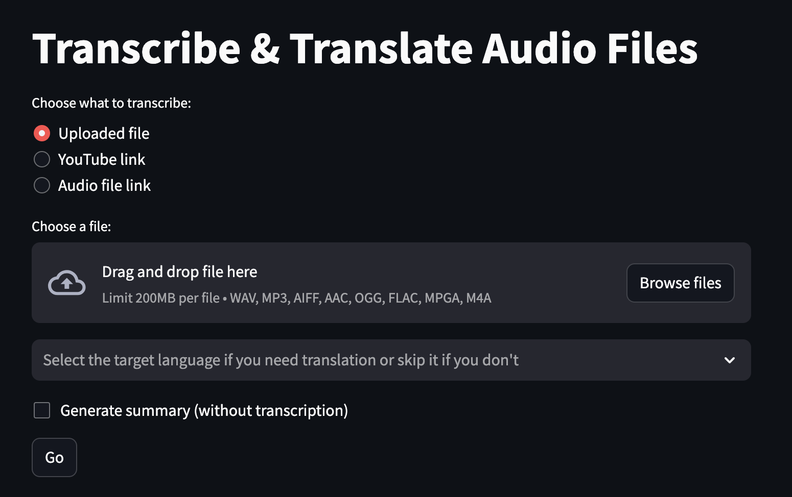
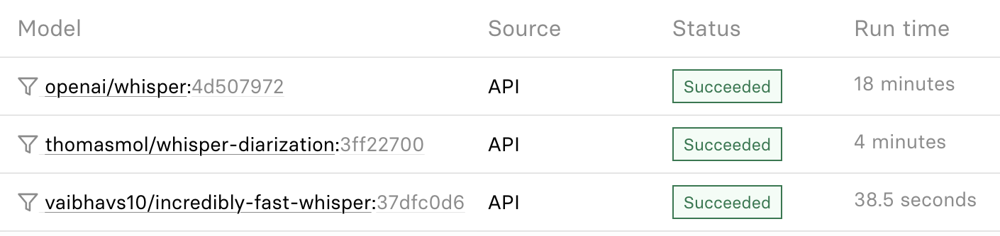

# The Transcriber


[](LICENSE)
[](https://app.deepsource.com/gh/vasiliadi/transcriber/)
[](https://github.com/astral-sh/ruff)
[](https://github.com/facebook/pyrefly)
[](https://pixi.sh)

Transcriber &amp; translator for audio files. Like Otter.ai, but open-source and almost free.



## Otter.ai

[Otter.ai](https://otter.ai/pricing) monthly subscription is **\$16.99** per user. \
You get:
> 1200 monthly transcription minutes; 90 minutes per conversation

## The Transcriber app

**Transcription**:
[Replicate AI models cloud-hosting](https://replicate.com/pricing) with current prices and models used, 1200 minutes will cost approximately **\$1.60 - \$5.50** \
At least three times cheaper with the same or even better quality of transcription, in my opinion. \
And you pay as you go.

**Translation (summarization is deprecated[^1]; use [vasiliadi/ai-summarizer-telegram-bot](https://github.com/vasiliadi/ai-summarizer-telegram-bot))**:
[Gemini Pro/Flash](https://ai.google.dev/pricing) is **free** if you use the Gemini API **from a project that has billing disabled**, without the benefits available in the paid plan.

**Hosting**:
Free tiers or trials from [Render](https://render.com/pricing), [Google Cloud](https://cloud.google.com/free), [Oracle Cloud](https://www.oracle.com/cloud/free/), [AWS](https://aws.amazon.com/free/), [Azure](https://azure.microsoft.com/en-us/pricing/free-services), [IBM Cloud](https://www.ibm.com/cloud/free), or low-cost [DigitalOcean](https://www.digitalocean.com/), or any provider you like.

**Total**:[^2] \
Pay as you go for 10 hours audio. \
Replicate with `whisper-diarization` + free Gemini API + DigitalOcean = \$2.00 + \$0.00 + \$0.10 = **\$2.10** \
Replicate with `incredibly-fast-whisper` + free Gemini API + DigitalOcean = \$0.70 + \$0.00 + \$0.10 = **\$0.80**

> [!NOTE]
> Prices are subject to change without notice.

## How to start

**AI agent setup (one-liner):**

```text
Read https://raw.githubusercontent.com/vasiliadi/transcriber/main/llms.txt and follow the instructions to run transcriber locally.
```

**Docker Compose:**

Install [Docker Desktop](https://www.docker.com/products/docker-desktop/) first if Docker is not already installed.

```sh
docker compose up --build
```

The app will be available at `http://localhost:80`. Secrets are loaded from `src/.streamlit/secrets.toml` if it exists (see [Config](#config)).

To stop:

```sh
docker compose down
```

**Docker (pre-built image from Docker Hub):**

```sh
docker run -p 8080:8080 \
  -e REPLICATE_API_TOKEN=your_token \
  -e GEMINI_API_KEY=your_key \
  -e HF_ACCESS_TOKEN=your_token \
  vasiliadi/transcriber:latest
```

The app will be available at `http://localhost:8080`.

To stop: press `Ctrl+C`.

**Manual setup:**

Install [pixi](https://pixi.sh/latest/#installation):

```sh
# macOS (Homebrew)
brew install pixi

# or via install script
curl -fsSL https://pixi.sh/install.sh | sh
```

Clone the repo, create `.streamlit/secrets.toml` with your API keys (see [Config](#config)), then run:

```sh
pixi run start
```

## Technical details

[Running the Whisper model on Replicate](https://replicate.com/openai/whisper) is much cheaper than using the [OpenAI API for Whisper](https://openai.com/pricing).

I use four models:

[vaibhavs10/incredibly-fast-whisper](https://replicate.com/vaibhavs10/incredibly-fast-whisper) best for speed \
[thomasmol/whisper-diarization](https://replicate.com/thomasmol/whisper-diarization) best for dialogs \
[openai/gpt-4o-transcribe](https://replicate.com/openai/gpt-4o-transcribe) best for accuracy \
[victor-upmeet/whisperx](https://replicate.com/victor-upmeet/whisperx) best overall

Comparison of the same 45-minute audio file (6 speakers) by model (example)


### Limitations

#### OpenAI Whisper model

[OpenAI Speech to text Whisper model](https://platform.openai.com/docs/guides/speech-to-text)

> File uploads are currently limited to 25 MB.

To avoid this limitation, I compress the audio before uploading (the models apply their own compression, but in practice I still hit the limit when relying on it). 45 minutes of audio is 63 MB raw and 4 MB compressed, which pushes the limit to roughly 3 hours 45 minutes without losing transcription quality — no chunking needed.

For anything longer you would have to split the file, which brings its own problems: splitting purely by time cuts words in half, and post-processing gets harder because speaker identity and timestamps don't survive the seams.

#### Gemini post-processing

Diarized transcripts are translated one segment at a time, so every line keeps its own timestamp and speaker label. The cost is that each segment is translated without the context of its neighbours — slightly lower quality than a single pass — plus a short rate-limit pause between calls, which is what makes long files slow. See [languages supported](https://cloud.google.com/vertex-ai/generative-ai/docs/learn/models#language-support) for translation.

### Optional settings

#### HuggingFace.co

For diarization, all models rely on [pyannote.audio](https://huggingface.co/pyannote) solutions. As a user, you must agree to the terms for accessing the models offered by pyannote. Therefore, it is necessary to accept the terms for [pyannote/segmentation-3.0](https://hf.co/pyannote/segmentation-3.0) and [pyannote/speaker-diarization-3.1](https://hf.co/pyannote/speaker-diarization-3.1) and obtain a [HuggingFace API token](https://huggingface.co/settings/tokens).

The [thomasmol/whisper-diarization](https://replicate.com/thomasmol/whisper-diarization) model also uses the same models for diarization, but the developer uses his own HuggingFace API token. This means that an additional token is not required.

### Config

Example of `.env` file:

```text
GEMINI_API_KEY="your_api_key"
REPLICATE_API_TOKEN="your_api_key"
HF_ACCESS_TOKEN="your_api_key" # only for incredibly-fast-whisper and whisperx models with enabled diarization
PROXY="" # only if you need to use proxy
```

**All keys are mandatory**, but you can fill some of them with placeholder or incorrect values to complete the setup. Using features that require a specific key with an incorrect value will result in an error.

You need to replace the path to the `env_file` in `compose.yaml`.

[Get Gemini API key](https://ai.google.dev/) \
[Get Replicate API token](https://replicate.com/account/api-tokens) \
[Get HF API tokens](https://huggingface.co/settings/tokens), and don't forget to accept the terms for [pyannote/segmentation-3.0](https://hf.co/pyannote/segmentation-3.0) and [pyannote/speaker-diarization-3.1](https://hf.co/pyannote/speaker-diarization-3.1). This is needed only for the `incredibly-fast-whisper` model with diarization enabled.

[Streamlit Secrets management](https://docs.streamlit.io/develop/concepts/connections/secrets-management)

## PS

Your transcription and [Google NotebookLM](https://notebooklm.google.com/) are a very powerful combination. \
Using [context caching](https://github.com/google-gemini/cookbook/blob/main/quickstarts/Caching.ipynb), you can ask a ton of questions about the topic.

### Docs

|  | Links |
| ---|--- |
| Libraries | [streamlit](https://docs.streamlit.io)<br>[replicate](https://replicate.com/docs/get-started/python)<br>[Google Gen AI SDK](https://github.com/googleapis/python-genai)<br>[yt-dlp](https://github.com/yt-dlp/yt-dlp)<br>[bs4](https://www.crummy.com/software/BeautifulSoup/bs4/doc/)<br>[curl_cffi](https://github.com/lexiforest/curl_cffi) |
| Docker | [Docker Best Practices](https://testdriven.io/blog/docker-best-practices/)<br><br>[Docker](https://docs.docker.com/language/python/)<br>[Dockerfile reference](https://docs.docker.com/reference/dockerfile/)<br>[Dockerfile Linter](https://hadolint.github.io/hadolint/)<br><br>[.dockerignore](https://docs.docker.com/build/building/context/#dockerignore-files)<br>[.dockerignore validator](https://dockerignore.vw.codes/)<br><br>[Docker Compose](https://docs.docker.com/compose/)<br>[Syntax for environment files in Docker Compose](https://docs.docker.com/compose/environment-variables/env-file/)<br>[Ways to set environment variables with Compose](https://docs.docker.com/compose/environment-variables/set-environment-variables/)<br>[Compose file version 3 reference](https://docs.docker.com/compose/compose-file/compose-file-v3/)|
| GitHub Actions | [Workflow syntax for GitHub Actions](https://docs.github.com/en/actions/using-workflows/workflow-syntax-for-github-actions)<br>[Publishing images to Docker Hub and GitHub Packages](https://docs.github.com/en/actions/publishing-packages/publishing-docker-images#publishing-images-to-docker-hub-and-github-packages) |
| Dev Containers | [An open specification for enriching containers with development specific content and settings](https://containers.dev/)<br>[Developing inside a Container](https://code.visualstudio.com/docs/devcontainers/containers) |
| uv | [uv pip](https://docs.astral.sh/uv/reference/cli/#uv-pip) |
| pixi | [pixi](https://pixi.prefix.dev/latest/) |
| direnv | [direnv](https://direnv.net/) |
| Speech to Text AI Model Leaderboard | [Artificial Analysis](https://artificialanalysis.ai/speech-to-text) |

### Deploy

| Platform | Links |
| --- | --- |
| Render | [Deploy from GitHub / GitLab / Bitbucket](https://docs.render.com/web-services#deploy-from-github--gitlab--bitbucket) |
| Google Cloud | [Quickstart: Deploy to Cloud Run](https://cloud.google.com/run/docs/quickstarts/deploy-container)<br>[Tutorial: Deploy your dockerized application on Google Cloud](https://community.intersystems.com/post/tutorial-deploy-your-dockerized-application-google-cloud) |
| Oracle Cloud | [Container Instances](https://www.oracle.com/cloud/cloud-native/container-instances/) |
| IBM Cloud | [IBM Cloud® Code Engine](https://www.ibm.com/products/code-engine) |
| AWS | [AWS App Runner](https://aws.amazon.com/apprunner/) |
| Azure | [Web App for Containers](https://learn.microsoft.com/en-us/azure/app-service/)<br>[Deploy a containerized app to Azure](https://code.visualstudio.com/docs/containers/app-service) |
| Digital Ocean | [How to Deploy from Container Images](https://docs.digitalocean.com/products/app-platform/how-to/deploy-from-container-images/) |

## License

This project is released into the public domain under the [Unlicense](LICENSE).

The published Docker image bundles third-party dependencies from two package
ecosystems — Python (pip) and conda/system (via the pixi `docker` environment).
Most are permissive (MIT/BSD/Apache-2.0), but some carry copyleft terms; full
details, including regeneration instructions, are in
[`THIRD_PARTY_NOTICES.md`](THIRD_PARTY_NOTICES.md). The most notable are:

- **mutagen** (Python) — GPL-2.0-or-later, pulled in transitively by `yt-dlp[default]`
- **ffmpeg** (conda) — GPL-2.0-or-later; the `-gpl` build variant conda-forge
  resolves for this project (`ffmpeg` is unpinned to a variant in
  `pyproject.toml`) also pulls in GPL-licensed encoders `x264`/`x265`
- **certifi** (Python) — MPL-2.0

The Docker image also bundles ~15 LGPL-licensed native libraries (audio/codec/
rendering dependencies of `ffmpeg`) and the standard GCC toolchain runtime
(GPL-3.0 with the GCC Runtime Library Exception) — see `THIRD_PARTY_NOTICES.md`
for the full inventory. Note the [license-scan CI workflow](.github/workflows/license-scan.yml)
covers **Python packages only**; conda/system packages are not scanned by
`pip-licenses` and must be reviewed manually if `pyproject.toml`'s conda
dependencies change.

[^1]: Last supported version is [0.1.0](https://github.com/vasiliadi/transcriber/releases/tag/0.1.0)
[^2]: For August 2024
